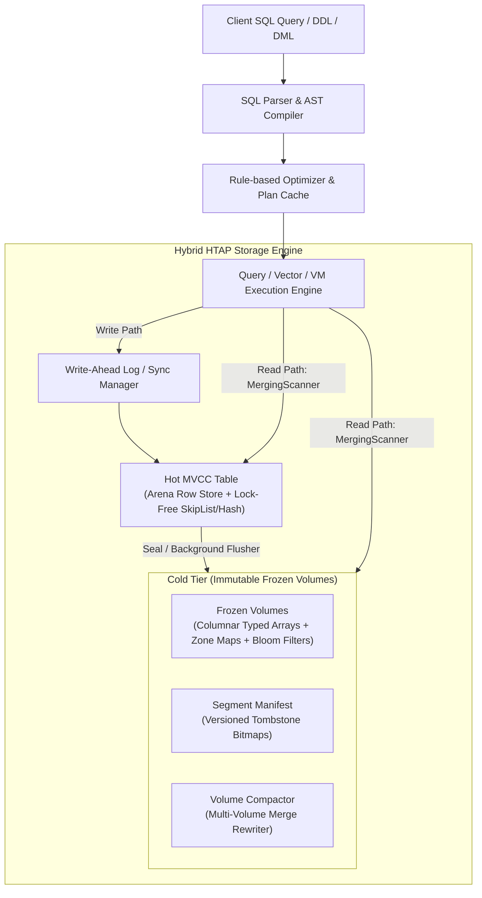

# Stoolap Architecture & Known Limitations Analysis

Welcome to the comprehensive architectural analysis of **Stoolap**, an embedded hybrid transactional/analytical processing (HTAP) SQL database written in Rust.

This documentation series provides a deep-dive technical investigation into each known limitation documented in the official Stoolap specification ([stoolap.io/docs/development/known-limitations](https://stoolap.io/docs/development/known-limitations/)). Each document explores the underlying subsystem architecture, identifies the root causes in the codebase, analyzes the performance and correctness implications, and outlines concrete engineering roadmaps for future development.

---

## Architectural Philosophy & Core Subsystems

Stoolap combines in-memory transactional processing with columnar frozen volume analytics:

1. **Parser & VM Layer** ([`src/parser/`](file:///home/irshad/stoolap/src/parser/), [`src/executor/expression/`](file:///home/irshad/stoolap/src/executor/expression/)): Tokenizes and translates SQL into compact AST nodes and stack-based bytecode evaluation programs.
2. **Executor & Optimizer** ([`src/executor/`](file:///home/irshad/stoolap/src/executor/), [`src/optimizer/`](file:///home/irshad/stoolap/src/optimizer/)): Implements vectorized filters, index-nested loop joins, hash joins, CTEs, window operators, and parallel aggregation.
3. **Hot MVCC Engine** ([`src/storage/mvcc/`](file:///home/irshad/stoolap/src/storage/mvcc/)): Provides snapshot isolation and serializable read-consistency using a lock-free version arena and WAL journaling.
4. **Cold Volume Engine** ([`src/storage/volume/`](file:///home/irshad/stoolap/src/storage/volume/)): Houses immutable, column-major data files with dictionary encoding, min/max zone maps, and CRC32 verification for high-speed analytical scans.

---

## Known Limitations Architecture Matrix

| # | Limitation Area | Key Restrictions | Primary Code Subsystem | Architectural Complexity |
|---|-----------------|-------------------|------------------------|-------------------------|
| **01** | [JSON Processing](file:///home/irshad/stoolap/docs/limitations/01-json-processing.md) | No in-place mutation (`JSON_SET`), no path queries (`JSON_CONTAINS`), no JSON indexing | [`src/core/value.rs`](file:///home/irshad/stoolap/src/core/value.rs), [`src/executor/expression/ops.rs`](file:///home/irshad/stoolap/src/executor/expression/ops.rs) | Medium |
| **02** | [Foreign Keys](file:///home/irshad/stoolap/docs/limitations/02-foreign-keys.md) | Single-column only, self-referencing batch insert ordering issues | [`src/executor/foreign_key.rs`](file:///home/irshad/stoolap/src/executor/foreign_key.rs), [`src/storage/index/`](file:///home/irshad/stoolap/src/storage/index/) | Medium |
| **03** | [Date & Timezone](file:///home/irshad/stoolap/docs/limitations/03-datetime-timezone.md) | UTC-only normalization, no `TIMESTAMPTZ` offset retention, no `CONVERT_TZ` | [`src/core/types.rs`](file:///home/irshad/stoolap/src/core/types.rs), [`src/functions/scalar/datetime.rs`](file:///home/irshad/stoolap/src/functions/scalar/datetime.rs) | Low-Medium |
| **04** | [Temporal Queries (`AS OF`)](file:///home/irshad/stoolap/docs/limitations/04-temporal-queries-as-of.md) | No subqueries with `AS OF`, clock drift vulnerability, VACUUM permanently purges history | [`src/storage/mvcc/version_store.rs`](file:///home/irshad/stoolap/src/storage/mvcc/version_store.rs), [`src/executor/subquery.rs`](file:///home/irshad/stoolap/src/executor/subquery.rs) | High |
| **05** | [Views & Virtual Tables](file:///home/irshad/stoolap/docs/limitations/05-views-and-virtual-tables.md) | Read-only views, shared table/view namespace, 32-level recursion limit | [`src/executor/ddl.rs`](file:///home/irshad/stoolap/src/executor/ddl.rs), [`src/storage/mvcc/registry.rs`](file:///home/irshad/stoolap/src/storage/mvcc/registry.rs) | Low-Medium |
| **06** | [ALTER TABLE Concurrency](file:///home/irshad/stoolap/docs/limitations/06-alter-table-concurrency.md) | Write-blocking schema changes, no composite PK alterations, cold volume schema lag | [`src/executor/ddl.rs`](file:///home/irshad/stoolap/src/executor/ddl.rs), [`src/storage/volume/scanner.rs`](file:///home/irshad/stoolap/src/storage/volume/scanner.rs) | High |
| **07** | [Upsert Conflict Resolution](file:///home/irshad/stoolap/docs/limitations/07-upsert-and-conflict-resolution.md) | No MySQL `VALUES()`, no `WHERE` filter predicate in `DO UPDATE SET` | [`src/executor/dml.rs`](file:///home/irshad/stoolap/src/executor/dml.rs), [`src/parser/`](file:///home/irshad/stoolap/src/parser/) | Low |
| **08** | [WebAssembly Runtime](file:///home/irshad/stoolap/docs/limitations/08-webassembly-runtime.md) | In-memory only (no OPFS persistence), single-threaded execution, no async WAL/vacuum | [`src/wasm.rs`](file:///home/irshad/stoolap/src/wasm.rs), [`src/storage/mvcc/engine.rs`](file:///home/irshad/stoolap/src/storage/mvcc/engine.rs) | High |
| **09** | [Cold Storage & Compaction](file:///home/irshad/stoolap/docs/limitations/09-cold-storage-volumes-compaction.md) | Cold rows lack `AS OF` version chains, compaction memory spikes, skip-set clone overhead | [`src/storage/volume/`](file:///home/irshad/stoolap/src/storage/volume/), [`src/storage/volume/table.rs`](file:///home/irshad/stoolap/src/storage/volume/table.rs) | High |
| **10** | [Transactions & PK Mutations](file:///home/irshad/stoolap/docs/limitations/10-transactions-and-pk-mutations.md) | `UPDATE` on primary key rejected (`row_id == pk` invariant) | [`src/storage/mvcc/table.rs`](file:///home/irshad/stoolap/src/storage/mvcc/table.rs), [`src/storage/index/pk.rs`](file:///home/irshad/stoolap/src/storage/index/pk.rs) | High |
| **11** | [SQL Features & Extensibility](file:///home/irshad/stoolap/docs/limitations/11-sql-features-and-extensibility.md) | No stored procs/triggers, no UDFs, no RBAC/GRANT, no inverted FTS index, no pub/sub | [`src/functions/registry.rs`](file:///home/irshad/stoolap/src/functions/registry.rs), [`src/executor/planner.rs`](file:///home/irshad/stoolap/src/executor/planner.rs) | Medium-High |
| **12** | [Data Types & Layouts](file:///home/irshad/stoolap/docs/limitations/12-data-types-and-type-system.md) | No BLOB/BINARY type, no ARRAY type, no ENUM type, no persistent INTERVAL column | [`src/core/types.rs`](file:///home/irshad/stoolap/src/core/types.rs), [`src/storage/volume/column.rs`](file:///home/irshad/stoolap/src/storage/volume/column.rs) | Medium |

---

## Directory Navigation

- [01. JSON Processing & Query Limitations](file:///home/irshad/stoolap/docs/limitations/01-json-processing.md)
- [02. Foreign Key Integrity & Multi-Column Constraints](file:///home/irshad/stoolap/docs/limitations/02-foreign-keys.md)
- [03. Date, Time & Timezone Architecture](file:///home/irshad/stoolap/docs/limitations/03-datetime-timezone.md)
- [04. Temporal Queries (`AS OF`) & History Pruning](file:///home/irshad/stoolap/docs/limitations/04-temporal-queries-as-of.md)
- [05. Views, Virtual Tables & Namespace Resolution](file:///home/irshad/stoolap/docs/limitations/05-views-and-virtual-tables.md)
- [06. ALTER TABLE, Concurrent Writes & Schema Adaptation](file:///home/irshad/stoolap/docs/limitations/06-alter-table-concurrency.md)
- [07. Upsert Execution (`ON CONFLICT` / `ON DUPLICATE KEY`)](file:///home/irshad/stoolap/docs/limitations/07-upsert-and-conflict-resolution.md)
- [08. WebAssembly (WASM) Architecture & In-Memory Constraints](file:///home/irshad/stoolap/docs/limitations/08-webassembly-runtime.md)
- [09. Cold Storage Engine (Frozen Volumes) & Compaction Engine](file:///home/irshad/stoolap/docs/limitations/09-cold-storage-volumes-compaction.md)
- [10. Transaction Model & Primary Key Mutability](file:///home/irshad/stoolap/docs/limitations/10-transactions-and-pk-mutations.md)
- [11. SQL Capabilities, Security & Extensibility](file:///home/irshad/stoolap/docs/limitations/11-sql-features-and-extensibility.md)
- [12. Type System, Complex Data Types & Column Layouts](file:///home/irshad/stoolap/docs/limitations/12-data-types-and-type-system.md)
